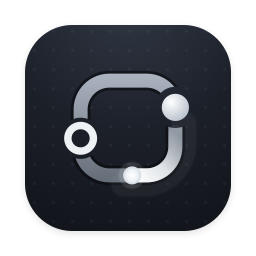

  

<h1 align="center">Zeroreq</h1>

zero-friction API client

## macOS releases

Push a semantic version tag such as `v0.1.0` to run the macOS release
workflow. The version in `crates/zeroreq/Cargo.toml` must match the tag.

The workflow builds an Apple Silicon (`arm64`) app, signs it with a Developer ID
Application certificate, enables the hardened runtime, notarizes the app and
DMG with Apple, staples the notarization tickets, and publishes the ZIP, DMG,
update manifest, and SHA-256 checksums to a GitHub release.

Zeroreq checks the latest GitHub release when an installed app starts. Users can
also choose **Zeroreq → Check for Updates…**. Before replacing the app, the
updater verifies the archive checksum, Apple Developer ID signature, expected
Team ID, and Gatekeeper assessment.
