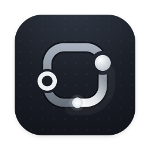

  

<h1 align="center">Request Eagle</h1>

zero-friction API client

## Development

Request Eagle uses Longbridge's `gpui-kit` 0.6.0. Import GPUI types from `gpui_kit`
and styled controls from `gpui_kit::component`. The workspace pins the kit
release; individual crates enable `component`, `assets`, and `test-support`
as needed. The HTTP client uses the matching `gpui-pre-reqwest-client` release
because the kit does not re-export it.

Run `cargo test --workspace --locked` to test the workspace, or `make run` to
build and launch the macOS app bundle.

## Settings

Open Settings with **⌘,**, the status bar settings button, or **Request Eagle → Settings…**.
General shows the installed version and update status. Use **Check for updates**
to check manually, then **Install and relaunch** when a new version is available.
**Request Eagle → About Request Eagle** opens General; **Check for Updates…** opens General
and starts a check. Automatic checks update the status quietly without opening Settings.

The Keybindings page lists the settings and workspace shortcuts. Search by command
name or shortcut, then click a shortcut to record a replacement in its row.
The recorder stays in the shortcut's column and captures every key, including
Escape, Enter, Tab, and Backspace. Use the buttons beside it to save, cancel,
or remove the shortcut. Each row also has a Remove button that works without
opening the recorder. You can reset individual commands or all commands to their defaults.

Changes take effect immediately and save to `~/.request-eagle/keybindings.json`.
On first launch, Request Eagle moves existing `~/.zeroreq` settings and collections
to `~/.request-eagle` if the new folder does not already exist.
If a saved shortcut conflicts with another binding at startup, the first registered
binding stays active and the conflicting command appears unassigned with an error
in Settings. Record a replacement or reset it to resolve the conflict. Startup
leaves the saved file unchanged.

New application commands should use `keybindings_service::register` to appear in
Settings with their label, description, category, and default shortcut.

## macOS releases

Push a semantic version tag such as `v0.1.0` to run the macOS release
workflow. The version in `crates/request-eagle/Cargo.toml` must match the tag.

The workflow builds an Apple Silicon (`arm64`) app, signs it with a Developer ID
Application certificate, enables the hardened runtime, notarizes the app and
DMG with Apple, staples the notarization tickets, and publishes the ZIP, DMG,
update manifest, and SHA-256 checksums to a GitHub release.

Request Eagle checks the latest GitHub release when an installed app starts. Users can
also choose **Request Eagle → Check for Updates…**. Before replacing the app, the
updater verifies the archive checksum, Apple Developer ID signature, expected
Team ID, and Gatekeeper assessment.
